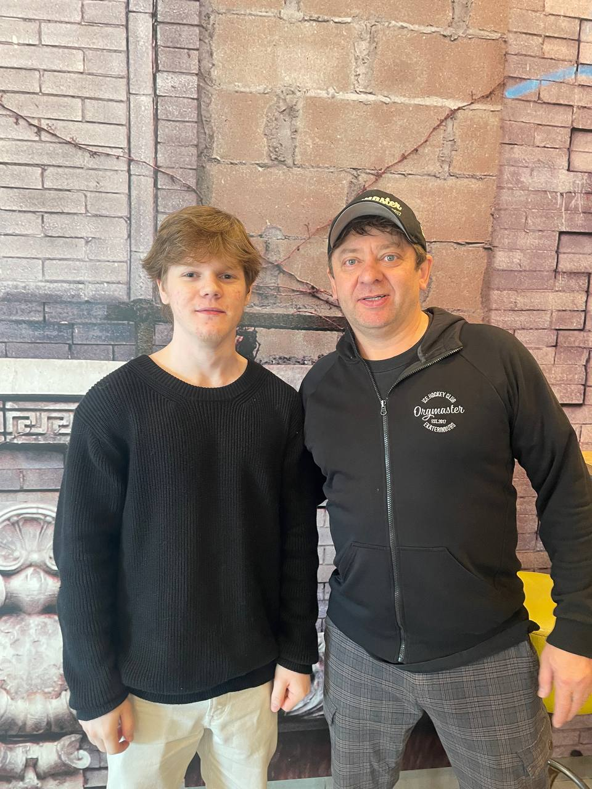

# "Информационные технологии и сервисы (Инструменты вайб-кодинга и инструменты для разработчика)"

*Мой репозиторий охраняет Брекоткин*
---

## ✨ Цитаты

> *«Кто имеет зачем жить, тот выдержит почти любое как»*  
> — **Фридрих Ницше**

> *«Magic is an abomination»*  
> — **Anti-mage**

---

## 🙂 Обо мне

- 🎓 Меня зовут Дмитрий Быков и я учусь на 1 курсе бакалавриата по направлению **«Прикладной искусственный интеллект»** в **УрФУ имени Б. Н. Ельцина**.  
- 🐾 У меня три кота: Кокос, Тимофей и ещё один таинственный пушистик.  
- 🎮 Люблю играть в **Dota 2** (мой герой — Антимаг).  
- 🐍 Немного умею программировать на **Python**.  
- 🗣️ Владею английским на уровне **B2**, также немного знаю французский и немецкий.  
- 🎬 Смотрю фильмы только на языке оригинала.  
- 🎵 Музыка всегда рядом — помогает учиться и отдыхать.  

---

## 🖥️ Навыки

- **Python** — простые скрипты и проекты.  
- **Git** — базовое владение системой контроля версий.  
- **Алгоритмы и структуры данных** — начинающий уровень.  

---

## 📅 Моё расписание

| День       | Время        | Предмет                                                                 |
|------------|--------------|-------------------------------------------------------------------------|
| **Понедельник** | 12:00–13:30 | Алгебра, геометрия и теория дифф. уравнений / Практика                  |
|            | 14:15–15:45 | Алгебра, геометрия и теория дифф. уравнений / Лекция                     |
|            | 16:00–17:30 | Программирование (повыш. уровень) / Лаба                                 |
|            | 17:40–19:10 | Программирование (повыш. уровень) / Лаба                                 |
| **Вторник**    | 10:15–11:45 | Основы российской государственности / Практика                         |
|            | 12:00–13:30 | Прикладная физическая культура                                           |
|            | 14:15–15:45 | Информационные технологии и сервисы / Лаба                               |
|            | 16:00–17:30 | Анализ данных и ИИ / Лаба                                                |
| **Среда**      | 10:15–11:45 | Иностранный язык (английский) / Практика                               |
|            | 14:15–15:45 | Дискретная математика / Практика                                         |
| **Четверг**    | 12:00–13:30 | Прикладная физическая культура                                         |
| **Пятница**    | 17:40–19:10 | Информационные технологии и сервисы / Лекция                           |
|            | 19:15–20:45 | Анализ данных и ИИ / Лекция                                              |
| **Суббота**    | 08:30–10:00 | Математика (повыш. уровень) / Лекция                                   |
|            | 10:15–11:45 | Математика / Практика                                                    |
|            | 12:00–13:30 | Математика / Практика                                                    |

---

## 📬 Контакты

- 💬 Telegram: `@skywalker44`  
- 🌐 GitHub: [github.com/skywxlker44](https://github.com/skywxlker44)  

---
